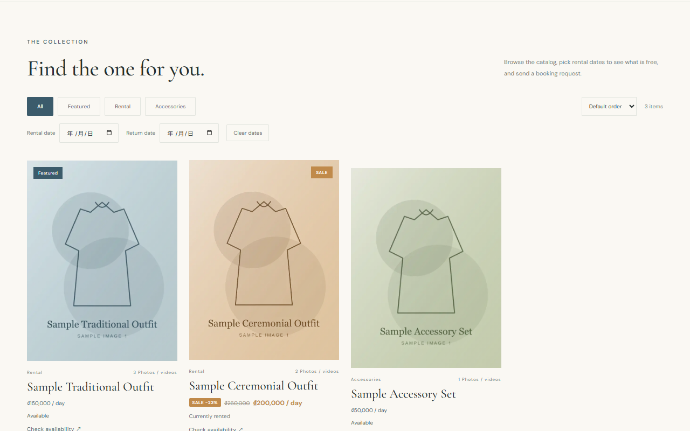
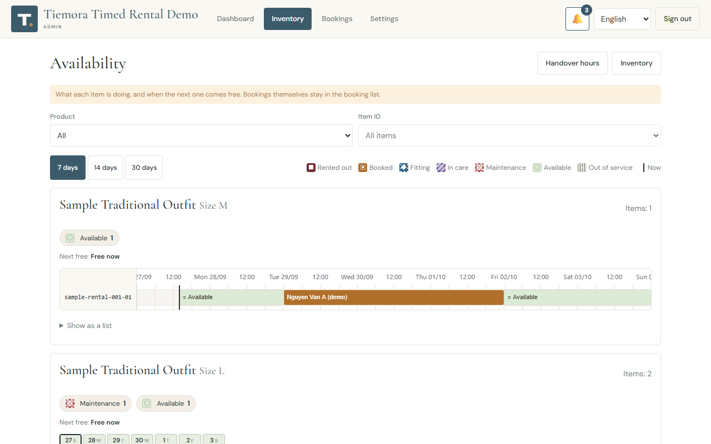
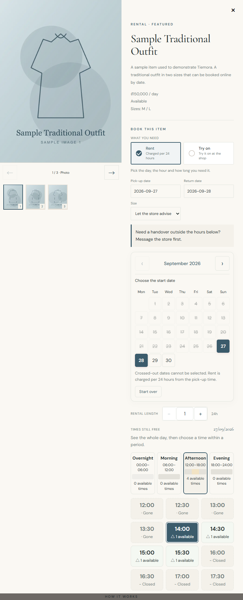
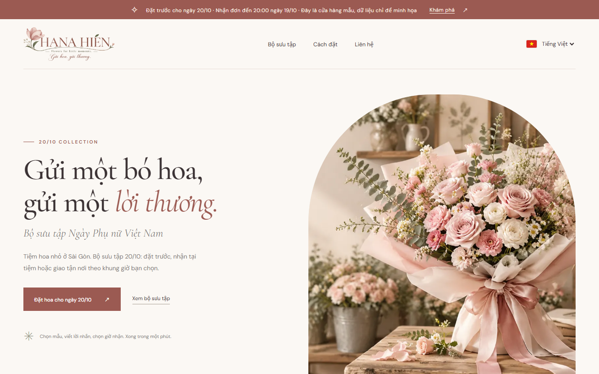
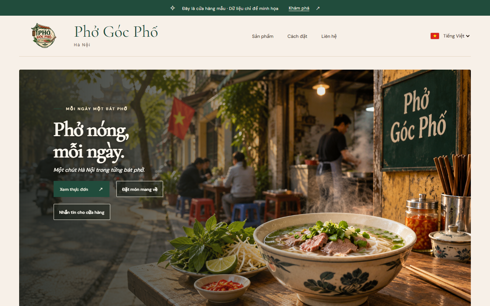
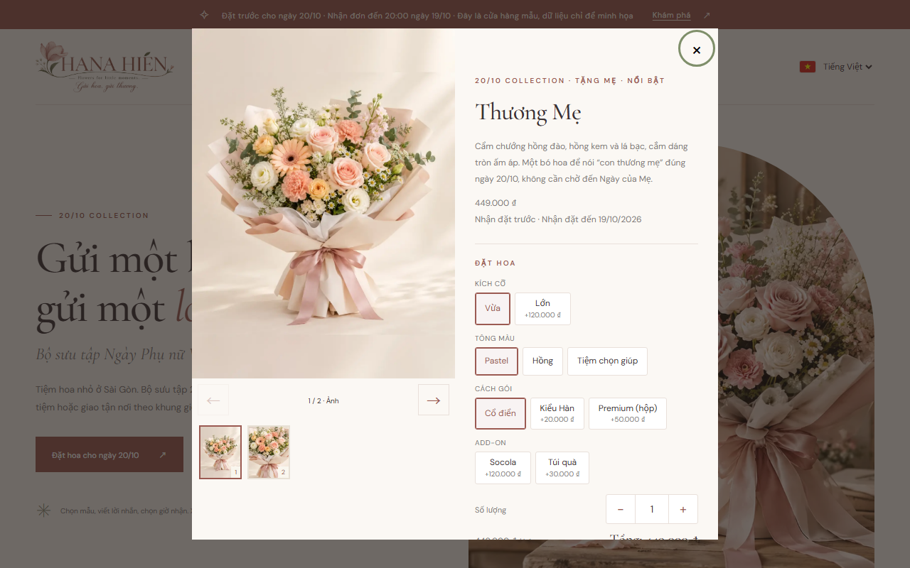
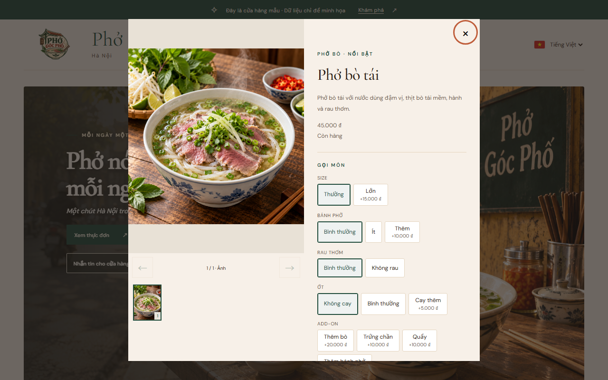
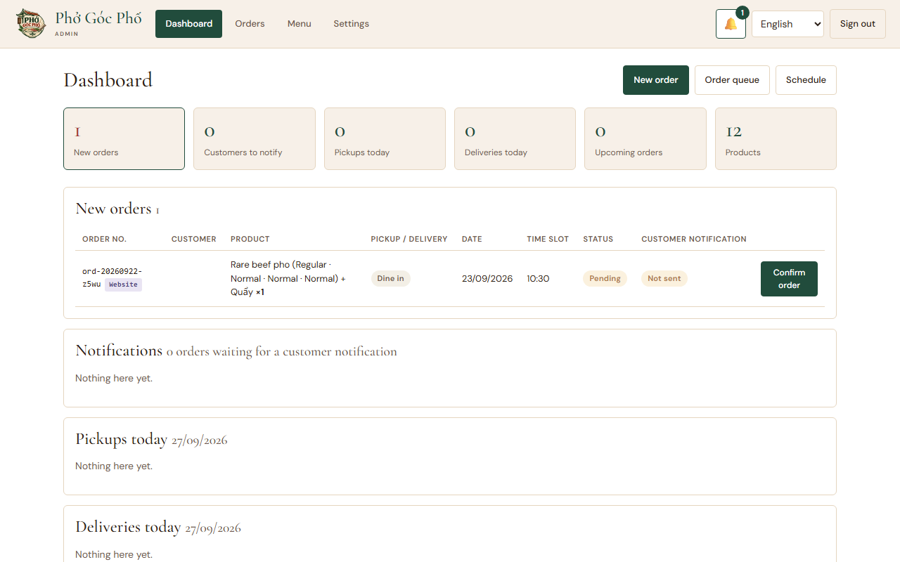
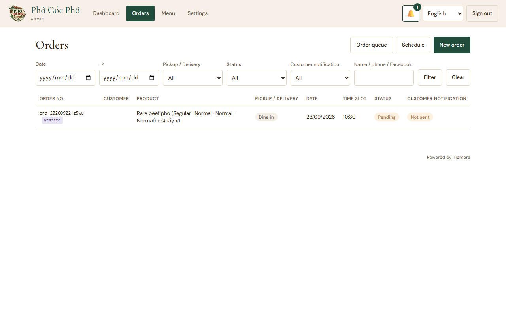
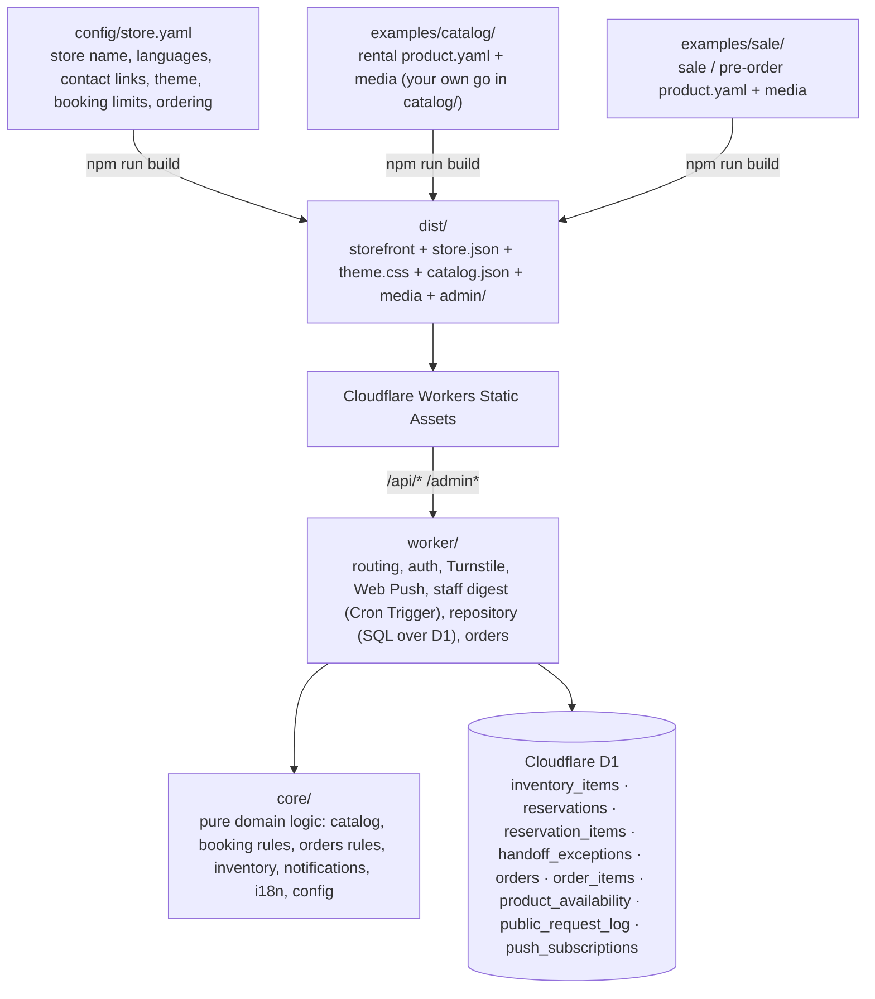

# Tiemora

<p align="center">
  
</p>

**Tiemora is an open-source catalog-first storefront, booking, ordering and inventory platform for small businesses.**

Vietnam-first workflows. Cloudflare-native infrastructure.

> Tiemora Core (this repository) is MIT-licensed and works on its own: clone, configure, deploy.
> It has no dependency on any hosted service other than your own Cloudflare account.

## What is Tiemora?

Small shops usually start with a beautiful catalog and a chat app. Tiemora keeps that workflow and adds just enough structure around it:

- a **catalog** written as folders of `product.yaml` + photos, published as a fast static site, with two product types: **rental** (booked by date) and **sale / pre-order** (bought by quantity);
- **availability by date** for rental items, and **capacity** (time slots, daily limits, stock) for sale / pre-order items;
- a **booking request form** and an **order form** customers can send without an account, with the contact channel they prefer (Zalo, WhatsApp, Messenger, phone);
- an **admin** for staff: dashboard, inventory, bookings (pending → confirmed → rented → returned), orders (pending → confirmed → preparing → ready → out for delivery → completed), customer-notification helpers and push notifications on their phones.

Nothing talks to WhatsApp, Zalo or Messenger APIs. Staff open a click-to-chat link or copy a message, send it from their own account, and mark the booking or order as notified. This keeps the platform free to run and simple to reason about.

## Features

| Area | What you get |
|---|---|
| Catalog | YAML product definitions, multilingual names and descriptions (vi / en / ja / zh), price and discount, category (or category list), tags, sizes, colours, images and videos, recursive folder scan, duplicate-id detection, `catalog.json` generation, automatic image optimisation |
| Storefront | Product grid and detail dialog, responsive, four languages, live stock status, date and pick-up time search, booking request form, sale order form with options / add-ons / quantity, privacy consent, Cloudflare Turnstile |
| Rental / booking | Whole-day or timed rentals (pick-up time + number of days, cheaper extra days), fitting (try-on) visits, per-size availability, turnaround between rentals, buffer days, handoff hours, opening hours, public holidays, rental terms shown on the booking form |
| Sale / local-store | Product options and add-ons, quantity, card message, pickup / delivery / dine-in, table metadata, opening hours, time slots or ASAP, daily capacity, total or daily stock, staff sold-out switches and deadlines, statuses `pending / confirmed / preparing / ready / out_for_delivery / completed / cancelled` |
| Inventory | Products (catalog) and inventory items (physical copies, `product-id-01`, `-02`, …) are separate; item statuses `available / reserved / rented / maintenance / inactive / cleaning`; per-item 7/14/30-day availability timeline for staff |
| Admin | Dashboard, inventory management with availability timeline and handoff exceptions, booking management, orders (list, detail, schedule, queue, staff-entered orders), Menu sold-out controls, confirm / hand over / return / cancel, maintenance, notification centre, read-only demo mode, settings; Vietnamese, English and Japanese UI |
| Customer contact helpers | WhatsApp click-to-chat with prefilled text, Messenger links, Zalo number + message copy, confirmation messages in four languages, preferred channel, "customer notified" record, shared by bookings and orders |
| Web Push | Admin devices subscribe from the settings page; a new booking request or order pushes to every device; a scheduled staff digest pushes today's / tomorrow's pick-ups, fittings, returns and pending requests; VAPID and RFC 8291 encryption implemented on Web Crypto with no dependency |
| Privacy & security | Privacy policy page, mandatory consent, Turnstile, server-side validation, password or Cloudflare Access admin login, CSRF protection, per-IP throttle, session cookies, `ADMIN_READ_ONLY` demo mode |
| Cloudflare | One Worker, Static Assets, D1, migrations, Turnstile, Web Push, Wrangler, local development, free-plan friendly |

## Screenshots

Rental, straight from this repository: `npm run build:timed-rental`, `npm run db:seed:local` and `npx wrangler dev`.

<p align="center">
  
  
</p>
<p align="center">
  
</p>

The dialog asks for a pick-up time, and shows the store's own handover notice, because [examples/timed-rental/store.yaml](examples/timed-rental/store.yaml) configures handover hours. The default build (`npm run dev`) uses the same catalog on whole calendar days. Two real deployments follow — their branding, artwork and catalogs are their own and are not part of Core.

<p align="center">
  
  
</p>
<p align="center">
  
  
</p>
<p align="center">
  
  
</p>

Run `npm run dev` and open `http://localhost:8787/` (storefront) and `http://localhost:8787/admin/` (admin, password from `.dev.vars`). The repository ships with three fictional rental sample products (`examples/catalog/`) and three fictional sale sample products (`examples/sale/`), with matching demo data (`seed/demo.sql`, `seed/sale-demo.sql`). The default is the rental sample, on whole calendar days. `npm run build:timed-rental` keeps that catalog and turns the rental rules on — pick-up times, handover hours, holidays, turnaround, fittings and rental terms — from `examples/timed-rental/store.yaml`. Build the 12-product Phở reference demo with `npm run build:pho-demo`; its separate configuration and artwork live in `examples/pho-demo/`. Neither demo touches `config/store.yaml`. Use the matching catalog before loading rental or generic sale seeds.

## Architecture



- `core/` has no Cloudflare or browser dependency and is unit-tested directly.
- `worker/db.mjs` is the repository; it only needs the D1 prepared-statement interface, which `tests/d1-shim.mjs` re-implements over `node:sqlite`. Porting to SQLite or PostgreSQL means writing that adapter.
- `storefront/` and `admin/` are plain HTML/CSS/JS with no build step of their own.

See [docs/architecture.md](docs/architecture.md).

## Quick Start

### Prerequisites

- Node.js 22.12 or newer (24 recommended; tests use `node:sqlite`)
- npm
- A Cloudflare account (free plan is enough)
- Wrangler (installed as a dev dependency; `npx wrangler …`)

### Local setup

```sh
git clone https://github.com/siska-tech/tiemora.git
cd tiemora
npm install
cp .dev.vars.example .dev.vars      # set ADMIN_PASSWORD
npm run dev                          # build → migrate local D1 → wrangler dev
```

Open `http://localhost:8787/`. The admin lives at `http://localhost:8787/admin/`. To load the demo bookings into the local database, run `npm run db:seed:local` in another terminal.

### Cloudflare setup

```sh
npm run login                        # once
npm run db:create                    # creates the D1 database "tiemora"; paste the database_id into wrangler.jsonc
npm run db:migrate                   # applies migrations/ to the remote database
npx wrangler secret put ADMIN_PASSWORD
```

### Turnstile and Web Push (optional)

Both need a key in three places (a var in `wrangler.jsonc`, a Cloudflare Secret and `.dev.vars`).
`npm run setup:*` creates the keys and writes all three; no secret is printed or pasted by hand.

```sh
npm run setup:turnstile -- --domain yourshop.example   # creates (or reuses) the widget
npm run setup:vapid -- --subject mailto:you@example.com
npm run setup:status                                   # what is configured, locally and on Cloudflare
```

Add `--dry-run` to see the changes first, `--local` to write only `.dev.vars`, and `--force` to replace
keys already in use (rotating VAPID signs every admin device out of push). Then `npm run deploy`:
the vars only reach the Worker with the next deploy.

### Build and deploy

```sh
npm run check                        # lint + typecheck + test + build
npm run deploy                       # build + wrangler deploy
```

Full walk-through: [docs/deployment-cloudflare.md](docs/deployment-cloudflare.md).

## Product Catalog

One folder per product, anywhere under the catalog directory:

```
catalog/
└─ dresses/
   └─ red-classic/
      ├─ product.yaml
      ├─ cover.jpg
      ├─ 02.jpg
      └─ demo.mp4
```

```yaml
id: dress-0001
name:
  vi: Váy đỏ cổ điển
  en: Classic Red Dress
category: dresses
price:
  rental: 300000
sizes: [S, M, L]
inventory:
  managed: true      # live stock from the admin's inventory items
```

Point `catalog.dir` in `config/store.yaml` at your folder (the default uses `examples/catalog`; `npm run build:pho-demo` selects the separate food demo). Details: [docs/catalog.md](docs/catalog.md).

## Booking & Inventory

- A **product** is the catalog entry. An **inventory item** is one physical copy: `dress-0001-01`, `dress-0001-02`, … registered in the admin.
- A public **request** is a `pending` booking that names a product (and size) but holds no item. Staff press **Confirm**: stock is re-checked and a free item is assigned. Then **Hand over** (`rented`) and **Returned** (item back to `available`).
- Timed rentals hold an item from pickup until it is ready after return and turnaround; fittings hold it for the appointment and buffer. Existing untimed bookings keep inclusive calendar-day ranges. Clashes are rejected at the API and again inside the database transaction, with `booking.bufferDays` applied to rentals.
- Handoff and opening hours (`booking.handoff`, `booking.openingHours`) set when items can be picked up and when the shop is open; staff add single-date exceptions in the admin, and `booking.handoff.holidayCountry` fills in public holidays at build time.
- Turnaround (`booking.turnaround`) puts a returned item into a `cleaning` status until it is ready again; the admin's per-item availability timeline (7 / 14 / 30 days) shows every booking, fitting, return and free day.
- An optional staff digest push (`admin.digest`) summarises today's or tomorrow's pick-ups, fittings, returns and unconfirmed requests on a schedule.

Details: [docs/booking.md](docs/booking.md), [docs/inventory.md](docs/inventory.md). Upgrade and scope: [v0.4.0 release notes](docs/releases/v0.4-result.md).

## Orders (sale / local-store, v0.3)

- A `type: sale` product is sold by quantity, not booked by date. A customer picks option groups (size, tone, …) and add-ons, writes an optional card message, chooses **pickup**, **delivery** or enabled **dine-in**, a day and a time slot (or enabled ASAP), and sends an order.
- Capacity is counted, not itemised: a time slot holds N orders, a day holds N orders, a product sells N units (`ordering.stock` in `product.yaml`). Every limit is optional.
- Staff manage orders in the admin: list, detail, day schedule, status flow `pending → confirmed → preparing → ready → (out_for_delivery) → completed / cancelled`, and the same notification helpers as bookings.
- Rental and sale products can live in the same catalog; the admin shows the modules the catalog needs.

Multi-item orders are repriced on the server. Daily stock, opening hours, table validation and staff sold-out controls support local shops. The existing cart UI ships with a provisional state contract; mixed fulfillment remains deferred.

Details: [docs/orders.md](docs/orders.md). Upgrade and scope: [v0.3.0 release notes](docs/releases/v0.3-result.md).

## Admin

`/admin/` is a small hash-routed app behind a password login (or Cloudflare Access). Dashboard, inventory (with the per-item availability timeline and handoff exceptions), bookings, orders (list, detail, schedule, queue, staff-entered orders, Menu sold-out switches), notification centre (bell), settings (push notifications, store configuration summary). Vietnamese, English and Japanese; the starting language comes from `admin.defaultLanguage`. The staff digest is scheduled in `config/store.yaml` (`admin.digest`), not in the admin.

## Cloudflare Deployment

Everything runs on one Worker with Static Assets and one D1 database. `wrangler.jsonc` ships with a placeholder `database_id` and empty keys; nothing in the repository identifies a real account. See [docs/deployment-cloudflare.md](docs/deployment-cloudflare.md).

## Configuration

All store-specific values live in [config/store.yaml](config/store.yaml): name, tagline, description, hero, announcement, languages, currency, time zone, phone country code, contact channels, category labels, theme colours, booking rules (limits, timed rentals, handoff/opening hours, turnaround, fittings, holidays, rental terms), ordering (sale / pre-order fulfillment, dates, capacity, options, add-ons, card message), admin language and digest schedule. The build validates the file and publishes it as `/store.json`. Secrets never go there. Reference: [docs/configuration.md](docs/configuration.md).

## Security

- Admin: HMAC-signed session cookie (HttpOnly, SameSite=Strict) or Cloudflare Access JWT; optional bearer token for scripts.
- Writes require `X-Requested-With: fetch` and a same-origin `Origin` / `Sec-Fetch-Site` (CSRF).
- Public form: server-side validation of every field, Turnstile when configured, per-IP throttle (hashed IPs), duplicate-request folding, privacy consent required.
- Content Security Policy on the admin pages; `dist/` never contains YAML, config secrets or originals.
- Report vulnerabilities privately: see [SECURITY.md](SECURITY.md).

## Roadmap

**Supported now** — Catalog · Rental / booking (whole-day and timed, fittings, turnaround, handoff/opening hours, holidays) · Sale / pre-order (pickup, delivery, dine-in) · Orders · Inventory · Admin · Staff digest · Customer contact helpers · Web Push · Read-only demo mode · Cloudflare deployment

**Future** — Workshop / class bookings · Appointments beyond fittings · Unified fulfillment vocabulary · Theme system · Setup wizard (Tiemora Studio) · Other database adapters

Only the items under "Supported now" are implemented today.

## Contributing

Issues and pull requests are welcome. Please read [CONTRIBUTING.md](CONTRIBUTING.md) and the [Code of Conduct](CODE_OF_CONDUCT.md).

## License

[MIT](LICENSE). Flag icons in `storefront/assets/flags/` are MIT-licensed (see the LICENSE file in that folder).
